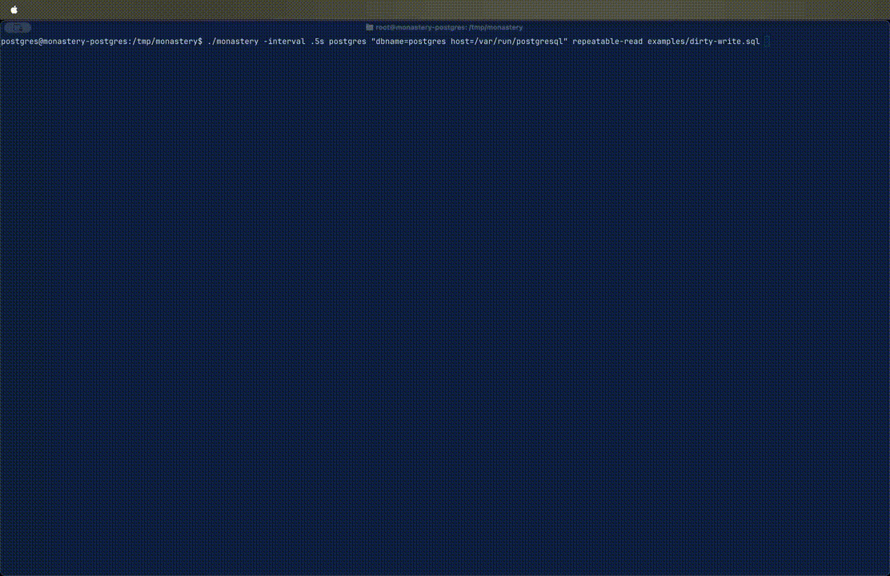

# Monastery

A tool for testing and observing transaction behavior.



```
$ git clone https://github.com/theconsensuslabs/monastery
$ cd monastery
$ go build -buildmode=plugin -o postgres.so ./plugins/postgres/ # Optional, for Postgres.
$ go build -buildmode=plugin -o mysql.so ./plugins/mysql/ # Optional, for MariaDB or MySQL.
$ go build
```

For example to test the behavior of [Dirty Writes](https://jepsen.io/consistency/phenomena/p0)
in PostgreSQL at the repeatable-read isolation level.

```sql
$ cat examples/dirty-write.sql
DROP TABLE IF EXISTS shoes;
CREATE TABLE shoes (left_shoe TEXT, right_shoe TEXT, shoe_id INT PRIMARY KEY);
INSERT INTO shoes VALUES ('', '', 1);

---

t1: BEGIN;
t2: BEGIN;
t1: UPDATE shoes SET left_shoe = 'Lin' WHERE shoe_id = 1;
t2: UPDATE shoes SET left_shoe = 'Carlos' WHERE shoe_id = 1;
t2: UPDATE shoes SET right_shoe = 'Carlos' WHERE shoe_id = 1;
t1: UPDATE shoes SET right_shoe = 'Lin' WHERE shoe_id = 1;
t1: SELECT * FROM shoes; # Inconsistent results here would mean dirty reads not necessarily dirty writes.
t2: SELECT * FROM shoes; # Inconsistent results here would mean dirty reads not necessarily dirty writes.
t1: COMMIT;
t2: COMMIT;
t1: SELECT * FROM shoes; -- assert ({Lin, Lin, 1}) or ({Carlos, Carlos, 1})
t2: SELECT * FROM shoes; -- assert ({Lin, Lin, 1}) or ({Carlos, Carlos, 1})
```

Start up Postgres.

```shell
$ initdb testdb
$ postgres -D testdb -p 4000
```

And in another run Monastery against Postgres and this script.

```shell
$ ./monastery postgres 'host=localhost port=4000 sslmode=disable dbname=postgres' repeatable-read examples/dirty-write.sql
┌──────────┬────────────────────────────────────────────────────────────┬──────────────┬──────────────┬────────────────────┬────────────────────────────────────────┬──────────────────────────────────────────────────┐
│CLIENT    │COMMAND                                                     │STARTED       │ENDED         │RESULTS             │ERROR                                   │ASSERT                                            │
╞──────────╪────────────────────────────────────────────────────────────╪──────────────╪──────────────╪────────────────────╪────────────────────────────────────────╪──────────────────────────────────────────────────╡
│setup     │DROP TABLE IF EXISTS shoes;                                 │17:43:02.732  │17:43:02.735  │                    │                                        │                                                  │
├──────────┼────────────────────────────────────────────────────────────┼──────────────┼──────────────┼────────────────────┼────────────────────────────────────────┼──────────────────────────────────────────────────┤
│setup     │CREATE TABLE shoes (left_shoe TEXT, right_shoe TEXT, shoe_id│17:43:02.736  │17:43:02.738  │                    │                                        │                                                  │
│          │INT PRIMARY KEY);                                           │              │              │                    │                                        │                                                  │
├──────────┼────────────────────────────────────────────────────────────┼──────────────┼──────────────┼────────────────────┼────────────────────────────────────────┼──────────────────────────────────────────────────┤
│setup     │INSERT INTO shoes VALUES ('', '', 1);                       │17:43:02.738  │17:43:02.739  │                    │                                        │                                                  │
├──────────┼────────────────────────────────────────────────────────────┼──────────────┼──────────────┼────────────────────┼────────────────────────────────────────┼──────────────────────────────────────────────────┤
│t1        │BEGIN;                                                      │17:43:02.741  │17:43:02.742  │()                  │                                        │                                                  │
├──────────┼────────────────────────────────────────────────────────────┼──────────────┼──────────────┼────────────────────┼────────────────────────────────────────┼──────────────────────────────────────────────────┤
│t2        │BEGIN;                                                      │17:43:03.042  │17:43:03.047  │()                  │                                        │                                                  │
├──────────┼────────────────────────────────────────────────────────────┼──────────────┼──────────────┼────────────────────┼────────────────────────────────────────┼──────────────────────────────────────────────────┤
│t1        │UPDATE shoes SET left_shoe = 'Lin' WHERE shoe_id = 1;       │17:43:03.342  │17:43:03.350  │()                  │                                        │                                                  │
├──────────┼────────────────────────────────────────────────────────────┼──────────────┼──────────────┼────────────────────┼────────────────────────────────────────┼──────────────────────────────────────────────────┤
│t2        │UPDATE shoes SET left_shoe = 'Carlos' WHERE shoe_id = 1;    │17:43:03.642  │17:43:05.150  │                    │pq: could not serialize access due to   │OK t2committed => ok or t2aborted => error        │
│          │                                                            │              │              │                    │concurrent update (40001)               │                                                  │
├──────────┼────────────────────────────────────────────────────────────┼──────────────┼──────────────┼────────────────────┼────────────────────────────────────────┼──────────────────────────────────────────────────┤
│t1        │UPDATE shoes SET right_shoe = 'Lin' WHERE shoe_id = 1;      │17:43:04.242  │17:43:04.248  │()                  │                                        │                                                  │
├──────────┼────────────────────────────────────────────────────────────┼──────────────┼──────────────┼────────────────────┼────────────────────────────────────────┼──────────────────────────────────────────────────┤
│t1        │SELECT * FROM shoes;                                        │17:43:04.542  │17:43:04.549  │({Lin, Lin, 1})     │                                        │OK ({Lin, Lin, 1})                                │
├──────────┼────────────────────────────────────────────────────────────┼──────────────┼──────────────┼────────────────────┼────────────────────────────────────────┼──────────────────────────────────────────────────┤
│t1        │COMMIT;                                                     │17:43:05.142  │17:43:05.150  │()                  │                                        │                                                  │
├──────────┼────────────────────────────────────────────────────────────┼──────────────┼──────────────┼────────────────────┼────────────────────────────────────────┼──────────────────────────────────────────────────┤
│t2        │UPDATE shoes SET right_shoe = 'Carlos' WHERE shoe_id = 1;   │17:43:05.158  │17:43:05.162  │                    │current transaction is aborted,         │OK t2committed => ok or t2aborted => error        │
│          │                                                            │              │              │                    │statement ignored                       │                                                  │
├──────────┼────────────────────────────────────────────────────────────┼──────────────┼──────────────┼────────────────────┼────────────────────────────────────────┼──────────────────────────────────────────────────┤
│t2        │SELECT * FROM shoes;                                        │17:43:05.166  │17:43:05.169  │                    │current transaction is aborted,         │OK t2committed => ({Carlos, Carlos, 1}) or        │
│          │                                                            │              │              │                    │statement ignored                       │t2aborted => error                                │
├──────────┼────────────────────────────────────────────────────────────┼──────────────┼──────────────┼────────────────────┼────────────────────────────────────────┼──────────────────────────────────────────────────┤
│t2        │COMMIT;                                                     │17:43:05.442  │17:43:05.452  │()                  │                                        │                                                  │
├──────────┼────────────────────────────────────────────────────────────┼──────────────┼──────────────┼────────────────────┼────────────────────────────────────────┼──────────────────────────────────────────────────┤
│t1        │SELECT * FROM shoes;                                        │17:43:05.742  │17:43:05.749  │({Lin, Lin, 1})     │                                        │OK ({Lin, Lin, 1}) or ({Carlos, Carlos, 1})       │
├──────────┼────────────────────────────────────────────────────────────┼──────────────┼──────────────┼────────────────────┼────────────────────────────────────────┼──────────────────────────────────────────────────┤
│t2        │SELECT * FROM shoes;                                        │17:43:06.042  │17:43:06.048  │({Lin, Lin, 1})     │                                        │OK ({Lin, Lin, 1}) or ({Carlos, Carlos, 1})       │
├──────────┼────────────────────────────────────────────────────────────┼──────────────┼──────────────┼────────────────────┼────────────────────────────────────────┼──────────────────────────────────────────────────┤
│final     │schedule: {t2aborted}                                       │              │              │                    │                                        │OK group: consistent schedule across {t2aborted,  │
│          │                                                            │              │              │                    │                                        │t2committed}                                      │
└──────────┴────────────────────────────────────────────────────────────┴──────────────┴──────────────┴────────────────────┴────────────────────────────────────────┴──────────────────────────────────────────────────┘
```

These events also get emitted to `monastery.jsonl`. You can filter them for a run by the uuid above.

```terminal
jq  -c 'select(.run_id=="fe1de39c-a00b-476a-9a40-deb975e70a04")' monastery.jsonl
```

Or run with `-events-only` flag.

```terminal
$ ./monastery -events-only postgres 'host=localhost port=4000 sslmode=disable dbname=postgres' repeatable-read hermitage/06-pmp.sql
```

You can slow down the run using `-interactive` to trigger each event one-by-one or run with `-interval .05s` to go slowly.

## Hermitage

There are builtin scripts that use
[Hermitage](https://github.com/ept/hermitage) test cases in
[./hermitage](./hermitage).

`run-hermitage.sh` runs every script in `hermitage/` against every
isolation level and prints a summary table:

```shell
$ ./run-hermitage.sh postgres 'host=localhost port=4000 sslmode=disable dbname=postgres'
| Test                                         | Read Uncommitted   | Read Committed     | Repeatable Read    | Serializable       |
|----------------------------------------------|--------------------|--------------------|--------------------|--------------------|
| 01-g0-write-cycles-dirty-writes              | FAIL               | OK                 | OK                 | OK                 |
| 02-g1a-aborted-reads-dirty-reads             | FAIL               | OK                 | OK                 | OK                 |
| 03-g1b-intermediate-reads-dirty-reads        | FAIL               | OK                 | OK                 | OK                 |
| 04-g1c-circular-information-flow-dirty-reads | FAIL               | OK                 | OK                 | OK                 |
...
```

Per-run JSONL logs and stdout/stderr land in `.hermitage-logs/` for inspection.

## Hermitage results

### Postgres

Ignore the failing column for Read Uncommitted. Postgres does not have this isolation level.

```shell
$ psql --version
psql (PostgreSQL) 18.3 (Ubuntu 18.3-1.pgdg24.04+1)

$ ./run-hermitage.sh postgres "dbname=postgres host=/var/run/postgresql"
```

Produces:

| Test                                         | Read Uncommitted   | Read Committed     | Repeatable Read    | Serializable       |
|----------------------------------------------|--------------------|--------------------|--------------------|--------------------|
| 01-g0-write-cycles-dirty-writes              | FAIL               | OK                 | OK                 | OK                 |
| 02-g1a-aborted-reads-dirty-reads             | FAIL               | OK                 | OK                 | OK                 |
| 03-g1b-intermediate-reads-dirty-reads        | FAIL               | OK                 | OK                 | OK                 |
| 04-g1c-circular-information-flow-dirty-reads | FAIL               | OK                 | OK                 | OK                 |
| 05-otv                                       | FAIL               | OK                 | OK                 | OK                 |
| 06-pmp                                       | FAIL               | FAIL               | OK                 | OK                 |
| 07-pmp-write-predicates                      | FAIL               | FAIL               | OK                 | OK                 |
| 08-p4-lost-update                            | FAIL               | FAIL               | OK                 | OK                 |
| 09-g-single-read-skew                        | FAIL               | FAIL               | OK                 | OK                 |
| 10-g-single-write-predicate                  | FAIL               | FAIL               | OK                 | OK                 |
| 11-g-single-predicate-read-skew              | FAIL               | FAIL               | OK                 | OK                 |
| 12-g2-item-write-skew                        | FAIL               | FAIL               | FAIL               | OK                 |
| 13-g2-predicate-read-write-skew              | FAIL               | FAIL               | FAIL               | OK                 |
| 14-g2-predicate-read-fekete-write-skew       | FAIL               | FAIL               | FAIL               | OK                 |

### MySQL

```shell
$ mysql --version
mysql  Ver 9.7.0 for Linux on x86_64 (MySQL Community Server - GPL)

$ ./run-hermitage.sh mysql 'root@tcp(localhost)/test'
```

Produces:

| Test                                         | Read Uncommitted   | Read Committed     | Repeatable Read    | Serializable       |
|----------------------------------------------|--------------------|--------------------|--------------------|--------------------|
| 01-g0-write-cycles-dirty-writes              | OK                 | OK                 | OK                 | OK                 |
| 02-g1a-aborted-reads-dirty-reads             | FAIL               | OK                 | OK                 | OK                 |
| 03-g1b-intermediate-reads-dirty-reads        | FAIL               | OK                 | OK                 | OK                 |
| 04-g1c-circular-information-flow-dirty-reads | FAIL               | OK                 | OK                 | OK                 |
| 05-otv                                       | OK                 | OK                 | OK                 | OK                 |
| 06-pmp                                       | FAIL               | FAIL               | OK                 | OK                 |
| 07-pmp-write-predicates                      | OK                 | OK                 | OK                 | OK                 |
| 08-p4-lost-update                            | FAIL               | FAIL               | FAIL               | OK                 |
| 09-g-single-read-skew                        | FAIL               | FAIL               | OK                 | OK                 |
| 10-g-single-write-predicate                  | FAIL               | FAIL               | FAIL               | OK                 |
| 11-g-single-predicate-read-skew              | FAIL               | FAIL               | OK                 | OK                 |
| 12-g2-item-write-skew                        | FAIL               | FAIL               | FAIL               | OK                 |
| 13-g2-predicate-read-write-skew              | FAIL               | FAIL               | FAIL               | OK                 |
| 14-g2-predicate-read-fekete-write-skew       | FAIL               | FAIL               | FAIL               | OK                 |

### MariaDB

```shell
$ mariadb --version
mariadb from 11.8.6-MariaDB, client 15.2 for debian-linux-gnu (x86_64) using  EditLine wrapper

$ ./run-hermitage.sh mysql 'root:root@tcp(localhost)/test'
```

Produces:

| Test                                         | Read Uncommitted   | Read Committed     | Repeatable Read    | Serializable       |
|----------------------------------------------|--------------------|--------------------|--------------------|--------------------|
| 01-g0-write-cycles-dirty-writes              | OK                 | OK                 | OK                 | OK                 |
| 02-g1a-aborted-reads-dirty-reads             | FAIL               | OK                 | OK                 | OK                 |
| 03-g1b-intermediate-reads-dirty-reads        | FAIL               | OK                 | OK                 | OK                 |
| 04-g1c-circular-information-flow-dirty-reads | FAIL               | OK                 | OK                 | OK                 |
| 05-otv                                       | OK                 | OK                 | OK                 | OK                 |
| 06-pmp                                       | FAIL               | FAIL               | OK                 | OK                 |
| 07-pmp-write-predicates                      | OK                 | OK                 | OK                 | OK                 |
| 08-p4-lost-update                            | FAIL               | FAIL               | OK                 | OK                 |
| 09-g-single-read-skew                        | FAIL               | FAIL               | OK                 | OK                 |
| 10-g-single-write-predicate                  | FAIL               | FAIL               | OK                 | OK                 |
| 11-g-single-predicate-read-skew              | FAIL               | FAIL               | OK                 | OK                 |
| 12-g2-item-write-skew                        | FAIL               | FAIL               | FAIL               | OK                 |
| 13-g2-predicate-read-write-skew              | FAIL               | FAIL               | FAIL               | OK                 |
| 14-g2-predicate-read-fekete-write-skew       | FAIL               | FAIL               | FAIL               | OK                 |

## Expected behavior

This is a very fuzzy matchup of [A Critique of ANSI SQL Isolation
Levels](https://www.microsoft.com/en-us/research/wp-content/uploads/2016/02/tr-95-51.pdf)
and [Weak Consistency: A Generalized Theory and Optimistic
Implementations for Distributed
Transactions](https://publications.csail.mit.edu/lcs/pubs/pdf/MIT-LCS-TR-786.pdf)
and [Jepsen](https://jepsen.io/consistency/models) to very fuzzily
come to a view of what we might expect from these isolation levels.

Jepsen does a good job of talking about the differences between these two classifications. Refer to it authoritatively.

| Isolation Level  | G0 / P0 (Dirty Write) | G1(A/B/C) / P1 (Dirty Read) | P4C (Cursor Lost Update, NOT TESTED HERE!) | G-Single / P4 (Lost Update) | G2-Item / P2 (Fuzzy Read) | G2 / P3 (Phantom) | G-Single / A5A (Read Skew) | G2-Item / A5B (Write Skew) |
|------------------|-----------------------|-----------------------------|--------------------------------------------|-----------------------------|---------------------------|-------------------|----------------------------|----------------------------|
| Read Uncommitted | Not Possible          | Possible                    | Possible                                   | Possible                    | Possible                  | Possible          | Possible                   | Possible                   |
| Read Committed   | Not Possible          | Not Possible                | Possible                                   | Possible                    | Possible                  | Possible          | Possible                   | Possible                   |
| Repeatable Read  | Not Possible          | Not Possible                | Not Possible                               | Not Possible                | Not Possible              | Possible          | Not Possible               | Not Possible               |
| Serializable     | Not Possible          | Not Possible                | Not Possible                               | Not Possible                | Not Possible              | Not Possible      | Not Possible               | Not Possible               |

## Assertions

Each step can carry an `assert` after a `--`. The result is shown in the
`ASSERT` column (green when it holds, red when it doesn't), and `monastery`
exits non-zero if any assertion fails.

| Form                            | Passes when                                |
|---------------------------------|--------------------------------------------|
| `-- assert error`               | the statement returned an error            |
| `-- assert ok`                  | the statement returned no error            |
| `-- assert ()`                  | the statement returned no rows             |
| `-- assert ({1, 10}, {2, 20})`  | the rows match exactly, no order           |

Alternatives can be chained with ` or ` and the assertion holds if any of
them matches — useful when a step is allowed to either succeed with a
specific result or fail with an error depending on the isolation level:

```sql
t1: select * from test;  -- assert ({1, 12}, {2, 22}) or ({1, 11}, {2, 21})
t2: commit;              -- assert ok or error
```

Anything after a `#` in the assert expression is treated as a free-text
note and discarded:

```sql
t2: select * from test;  -- assert ({1, 11}, {2, 20}) or ({1, 10}, {2, 20})  # latter under SI
```

## Group invariants

Tag related steps with `-- group <name>` and monastery emits a
synthetic check row after the run. There are two modes, picked
automatically:

### Error mode (no labeled assertions in the group)

Per-step assertions hard-code which transaction the engine must abort.
That works for SSI (deterministic victim by commit order) but breaks on
S2PL implementations that resolve cycles via deadlock detection and may
pick a different victim. To assert "*some* transaction in this cycle
must abort, but I don't care which", tag each candidate step:

```sql
t1: update test set value = 0 where id = 1;          -- group cycle1
t2: update test set value = value + 5 where id = 2;  -- group cycle1
```

The check passes when at least one tagged step errored. The synthetic
row reads `group: at least one error`.

### Schedule mode (labeled `=>` branches)

When the same hidden serial order should govern several reads, label
each `or` branch with a short identifier and tag the reads with the
same group:

```sql
t1: update test set value = 11 where id = 1;
t2: update test set value = 12 where id = 1;
t1: commit;
t1: select * from test; -- group final; assert t2committed => ({1, 12}, {2, 22}) or t2aborted => ({1, 11}, {2, 21})
t2: select * from test; -- group final; assert t2committed => ({1, 12}, {2, 22}) or t2aborted => ({1, 11}, {2, 21})
```

Each branch carries an arbitrary label naming a serial-equivalence
class. Per-step status passes if any branch matches (same as today's
`or`). The group additionally requires a single label to be feasible
across all members — i.e., every member's matched branch set agrees on
some L. Mixed outcomes (e.g. one read sees `t2committed`, the other
sees `t2aborted`) fail the group as `no consistent schedule`.

Unlabeled `or` branches act as wildcards for the group check. Members
without an `assert` directive (e.g. `commit;`) are unconstrained. Pick
the mode that fits the invariant: schedule mode catches torn views
across multiple reads; error mode is for non-deterministic abort
victims.

### Composing

`group` and `assert` are composable, separated by `;`:

```sql
t1: commit; -- assert ok; group cycle1
```

Group checks are skipped when the run is interrupted (Ctrl-C), since a
missing member would spuriously fail the invariant.

## Per-driver script overrides

Some anomalies surface differently under SI/SSI vs. lock-based
serializable, and the right assertion depends on the engine. When
loading `foo.sql`, monastery first looks for `foo.sql.<driver>` (e.g.
`foo.sql.mysql`) and uses that file if it exists. The actual path
loaded is recorded in the `session_start` event's `script` field.

`run-hermitage.sh` doesn't need any changes — its `*.sql` glob won't
match `*.sql.<driver>`, but the Go runner does the resolution.
